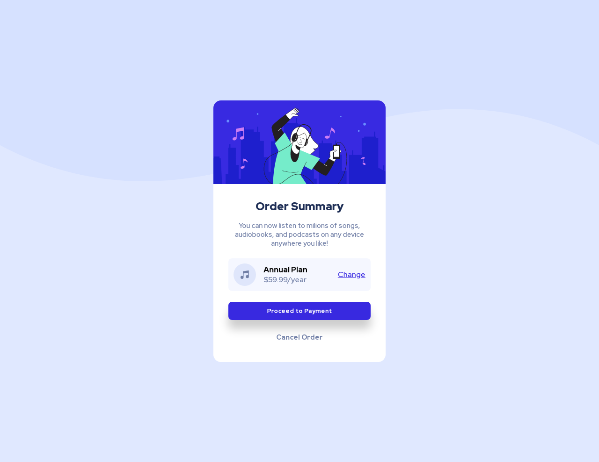

# Order summary card component

This is my solution to the [Order summary card component](https://www.frontendmentor.io/challenges/order-summary-component-QlPmajDUj) challenge 
from [Frontend Mentor](https://www.frontendmentor.io/home).

This challenge helped me a lot to improve my `flexbox`, `@media` and responsive CSS units skills.
## Final result: https://fabricio-x.github.io/order-summary-component-main/

